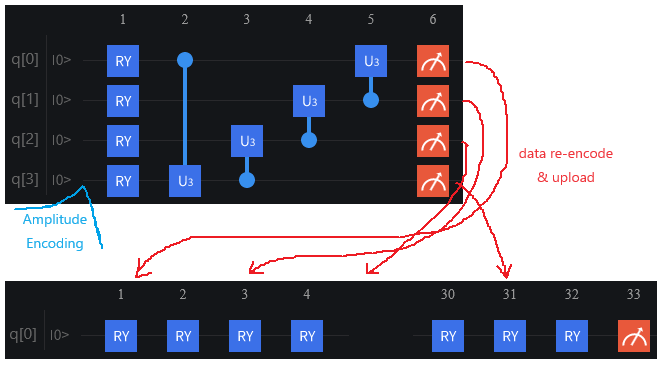

# WheelQNet: Quantum Binary Classification via Rotation Averaging

    Official implementaion of WheelQNet, yet another toyish quantum binary classifier implemented in pyVQNet

----

This repo contains code for the contest: 第一届量子信息技术与应用创新大赛 -- 本源量子VQNet量子机器学习大赛赛道  
Contest page: [https://contest.originqc.com.cn/contest/32/contest:introduction](https://contest.originqc.com.cn/contest/32/contest:introduction)  
Team Name: 做好坠机准备  



| Model | Param cnt. | Train acc. | Test acc. |
| :-: | :-: | :-: | :-: |
| HEA    | 32 | 78.608% | 82.178% |
| CCQC   | 52 | 79.494% | 81.188% |
| CCQC-q | 52 | 80.253% | 78.218% |
| WheelQ | 32 | 77.342% | 79.208% |

⚠ only `CCQC` has 1 classical parameter, the other models are all pure quantum parametricalized :)
ℹ the proposed WheelQNet looks 花里胡哨 though, it just works!! 🎉


### Quickstart

⚪ install

- `conda create -n vq python==3.8`
- `conda activare vq`
- `pip install -r requirements.txt`

⚪ run eval (on pretrained)

- `python -m src.preprocess -f`
- `python -m src.eval -L <logdir>`

⚪ run train (reproduce the submission)

- `python -m src.preprocess -f`
- `python -m src.train`

⚪ development

- `pip install -r requirements_dev.txt`
- `python preprocess.py -f`
- `python run_sklearn.py`
- `python run_vqnet.py`
  - see exmaples in `run_vqnet*.cmd`


#### refenrence

⚪ Q framework & method

- QPanda: [https://qpanda-tutorial.readthedocs.io/zh/latest/](https://qpanda-tutorial.readthedocs.io/zh/latest/)
- PyQPanda: [https://pyqpanda-toturial.readthedocs.io/zh/latest/index.html](https://pyqpanda-toturial.readthedocs.io/zh/latest/index.html)
- VQNet: [https://vqnet20-tutorial.readthedocs.io/en/latest/](https://vqnet20-tutorial.readthedocs.io/en/latest/)
- HEA (Hardware Efficient Ansatz): [https://arxiv.org/abs/1704.05018](https://arxiv.org/abs/1704.05018)
- CQCC (Circuit-Centric Quantum Classifiers): [https://arxiv.org/abs/1804.00633](https://arxiv.org/abs/1804.00633)
- YouroQNet: [https://github.com/Kahsolt/YouroQNet](https://github.com/Kahsolt/YouroQNet)

⚪ problem & data

- kaggle page: [https://www.kaggle.com/competitions/titanic/overview](https://www.kaggle.com/competitions/titanic/overview)
- solution guide: [https://towardsdatascience.com/a-beginners-guide-to-kaggle-s-titanic-problem-3193cb56f6ca](https://towardsdatascience.com/a-beginners-guide-to-kaggle-s-titanic-problem-3193cb56f6ca)


#### Citation

If you find this work useful, please give a star ⭐ and cite~ 😃

```
@misc{kahsolt2023,
  author = {Kahsolt},
  title  = {WheelQNet: Quantum Binary Classification via Rotation Averaging},
  howpublished = {\url{https://github.com/Kahsolt/WheelQNet}}
  month  = {December},
  year   = {2023}
}
```

----
by Armit
2023/10/27
